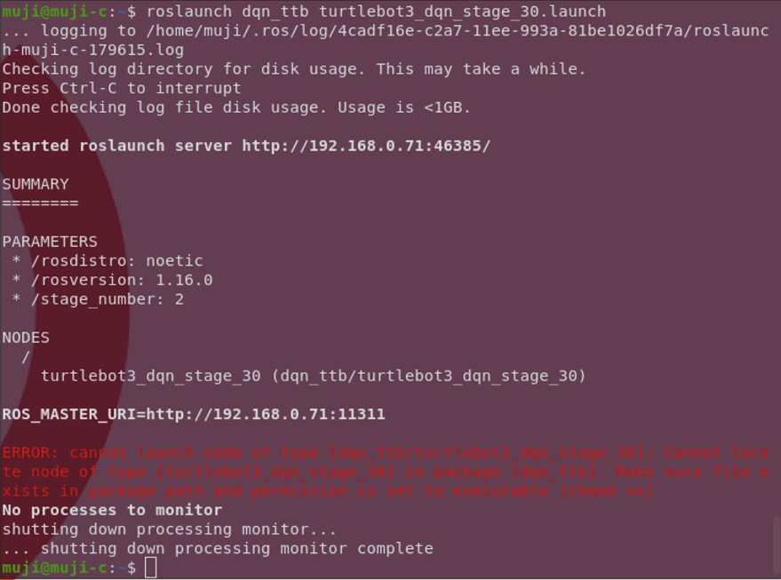

# Turtlebot3 Machine Learning

1. 터틀봇 DQN


# Description

로보티즈의 [공식 튜토리얼](https://emanual.robotis.com/docs/en/platform/turtlebot3/machine_learning/#machine-learning)에서 시작하였습니다.

모든 코드의 환경은 `ROS1`을 기반으로 하며 nn model들은 `PyTorch`를 이용하여 `CUDA toolkit`을 사용함을 기준으로 작성되었습니다.

추가적으로 기본 빌더(`catkin_make`)를 사용하지 않고  [`catkin_tools`](https://catkin-tools.readthedocs.io/en/latest/verbs/catkin_build.html)를 사용하였으며, 아래 설명에서 빌드 과정은 이를 기반으로 함을 밝힙니다.

아래에 코드 실행 순서를 작성하였습니다. 기본적으로 `Ubuntu base python`을 이용하며 필요한 파이썬 라이브러리는 셀프로 설치해주세요.
   ```
   torch torchvision torchaudio tqdm matplotlib seaborn numpy 
   ```

# Algorithms

1. [Deep Q-Learning](./src/dqn_ttb/README.md)


# Possible Errors

1. 노드 파일들의 속성을 실행가능하도록 해주세요. 안 그러면 아래와 같은 에러를 얻게 됩니다.
   <details>
   <summary>
   click to expand
   </summary>
   
   </details>


2. `catkin_make`와 `catkin build`를 혼동하였을 수 있습니다. ([참고 링크](https://catkin-tools.readthedocs.io/en/latest/migration.html))

